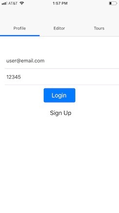
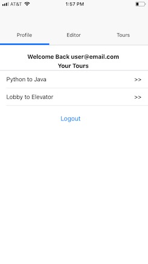
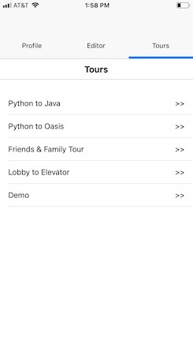
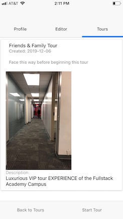

# Yellow Brick Road

## A mobile app for creating and experiencing tours in Augmented Reality

 

- [Introduction](#Introduction)
- [Created By](#Designed-and-Built-by)
- [Goals](#MVP-Goals)
- [Tech Stack](#Tech-Stack)
- [How it Works](#How-it-Works)

 

### Introduction

  Hello! Welcome to Yellow Brick Road. Yellow Brick Road is a mobile application that allows users to create, share, and experience tours in Augmented Reality. 
  
  Instead of showing users dierctions on a map, Yellow Brick Road presents users a 3D highlighted trail of markers in the environment (viewed through the user's device). Users follow the tour from point to point, and the view adjusts as the user progresses along the tour. The app relies on the relative position of the users's camera for tracking, rather than GPS. This allows it to succeed in spaces where other navigation apps do not, such as indoors or underground areas. 
  
  Future updates will allow for increased interactivity within a given tour, such as helpful animations or modals that provide landmark descriptions.

  Please click the picture below for a brief presentation and demonstration video, or scroll down for more information. Thanks for looking!

  

   

  ### Designed and Built by

  * Alex Paul
     - [GitHub](https://github.com/apaul14)
     - [LinkedIn](https://www.linkedin.com/in/alexpaul53)
    
  * Mark Dziwirek 
     - [GitHub](https://github.com/MarkDz)
     - [LinkedIn](https://www.linkedin.com/in/mark-dziwirek/)

  * Josh Grossman
     - [GitHub](https://github.com/Josh1794)
     - [LinkedIn](https://www.linkedin.com/in/joshua-grossman17/)

  * Christian Gerace
     - [GitHub](https://github.com/cgerace)
     - [LinkedIn](https://www.linkedin.com/in/christiangerace/)
  

### MVP Goals:

- Create an app that provides guided tours/directions in AR
- Allow users to create their own tours and add descriptions/relevant metadata
- Users can browse and check out uploaded tours
- Users can initialize and follow their selected tour

### Stretch Goals

- Allow users to take and upload "start here" images for each tour
- Add categorization, searching, and filtering for tour browsing/searching
- Directions for subways, streets, and museums
- Google maps integration
- Add support for informational modals, AR objects, and animated prompts
- Wall detection to hide tour points behind real world boundaries and obstacles
- Favoriting/liking/saving tours

### Tech Stack

- React Native
  - Mobile Framework we used to develop our application concurrently for IOS and Android devices

- ViroReact
  - Platform that utilizes Apple's ARKit or Android's ARCore to implement AR functionality such as tracking users and displaying tour points

- Native Base
  - UI library for creating menus, buttons, etc.

- Node.js & Express
  - We created an Express server to handle requests from the app and serve the appropriate data from our database

- PostgreSQL
  - Relational database for storing user created tours and directions

### How It Works

The menu portion of the app consists of 3 tabs: Tours, Editor, and Profile.

The Profile tab allows existing users to sign in to their account or new users to create a profile. Once signed in, users can view the tours they've created as well as start the Editor. The Editor can only be used after signing in, this to ensure tours are properly associated with their creators. 

In the Tours tab, a user can view all available tours. Selecting a tour will bring up it's profile, containing a description of the tour, an image of the starting view, and buttons to either start the tour or navigate back to the list.

Before starting the chosen tour, the user should position their phone so the view through their camera matches the starting image, this is important to ensure accurate placement of the tour points when they are loaded into the AR environment. 

After the tour loads there is a brief calibration, the tour points will appear, and the user can begin following along the route. Tap the arrow button on the top left of the screen to exit to the menu.

To create a tour, stand in the desired starting position with the rear-facing camera pointed forwards. Tap the Create Tour button, there will be another prompt to verify the correct start position. The first point is generated immediately after the editor is initialized, hence the importance of being properly positioned when starting the tour editor. After the editor loads, the user can walk in any direction, tapping Drop to connect the previous marker to a new marker at the current location of the device. If a mistake is made, tapping the top right arrow will undo the previous point. When the tour is completed, tap End. A modal will appear where the user can supply a title and brief description of their tour. Hit Submit, and the tour will be saved and made available for other users to experience.
